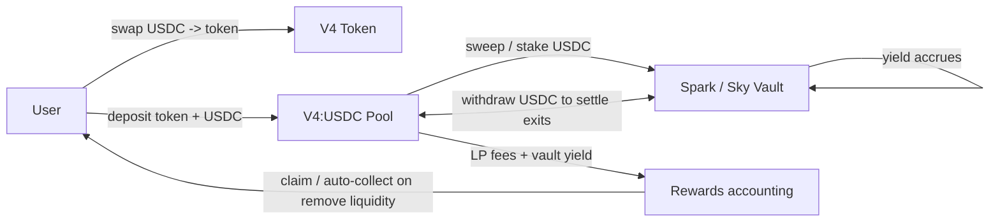
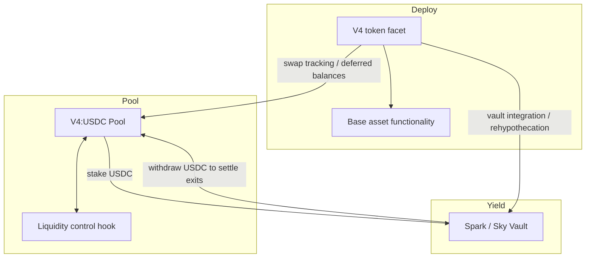

# Yieldmas – Rehypothecation-backed LP Yield Memecoin (Draft Spec)

> Converted from your Excalidraw sketch into a structured Markdown spec with **Mermaid diagrams**.

---

## Concept

Users buy the meme token with USDC, then provide liquidity into a **V4 Token : USDC** pool.  
The protocol rehypothecates USDC into a yield vault (e.g., **Spark / Sky**) and redistributes yield (+ fees) back to liquidity providers (and optionally lockers).

---

## User Journey (as written in the diagram)

1. Buy token using USDC  
2. USDC is counted as “common wealth” in Pool (it is deposited into yield bearing vault)  
3. Add liquidity (token + USDC) to activate participation in common wealth  
4. USDC is deposited again into yield bearing vault  
5. Token is locked for some time in contract (longer time → bigger reward?)  
6. When you sell USDC it is added to vault each time  
7. When you sell token then USDC is taken out from vault for liquidity  
8. Vault fees are tracked & automatically collected when you want to remove liquidity  
9. Locked token has inflation APY (example: 1 year deposit → same % as USDT APY)  
10. Custom AMM → computes amounts based on balances in PoolManager & Vault

---

## Core Economic Loop (diagram)

---

## “Common Wealth” / Accounting Intuition

From the sketch, the protocol tracks **two** categories of value:

- **On-hand pool balances**: what the PoolManager/pool holds *right now*
- **Deferred / vault-backed balances**: credits backed by assets sitting in the vault

A practical phrasing:

- The pool keeps just enough USDC for immediate swap/exit needs
- Excess USDC is deposited into the vault
- LPs (and/or lockers) earn a pro-rata share of vault yield + pool fees
- On exits/sells, the system pulls USDC out of the vault to settle

---

## Example Math (from your “Math” box, kept illustrative)

**Scenario**
1. 100 USDC → swap → 100 V4 tokens  
2. 100 USDC → stake → vault  
3. 100 V4 tokens + 101 USDC → add liquidity  
4. 101 USDC → stake → vault  
5. 100 V4 tokens → lock → pool  
6. User receives rewards:
   - 5% APY on 100 USDC (initial swap leg)
   - 5% APY on 101 USDC (liquidity leg)
   - 5% APY on V4 tokens (inflation)
7. Protocol generates +10% APY (+ fees)  
8. User profit ~15% APY (− fees)

After ~1 year (illustration from your note):
- user portfolio: **111.15 USDC + 105 V4 tokens**

> Exact outcomes depend on vault APY, fee model, how you attribute “swap-leg” yield, and how you price exits.

---

## Implementation Sketch (Facet / Hook Awareness)

Your later section shows:

1) **Initial deployment**: “V4 token facet” + base asset functionality  
2) **Pool creation with hook**  
3) **Attach facet aware of Pool, Hook & Vault**

---

## Open Questions (worth nailing early)

- **Locking target**: do you lock *LP position*, or *token-only* balance?  
- **When does USDC become “common wealth”**: on swap, on add-liquidity, or both?  
- **Avoiding double-counting**: how do you prevent creating claims that exceed vault-backed assets?  
- **Custom AMM vs Uniswap v4**: if you’re on v4, keep pricing inside PoolManager rules and put accounting/sweeps in hooks—unless you truly want a separate pricing mechanism.

---

## Excalidraw Source

I saved the original clipboard payload here so you can re-import it:

- `yieldmas_excalidraw_clipboard.json`

