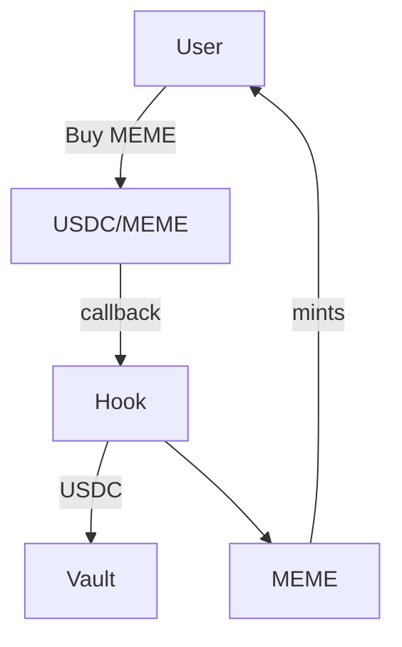
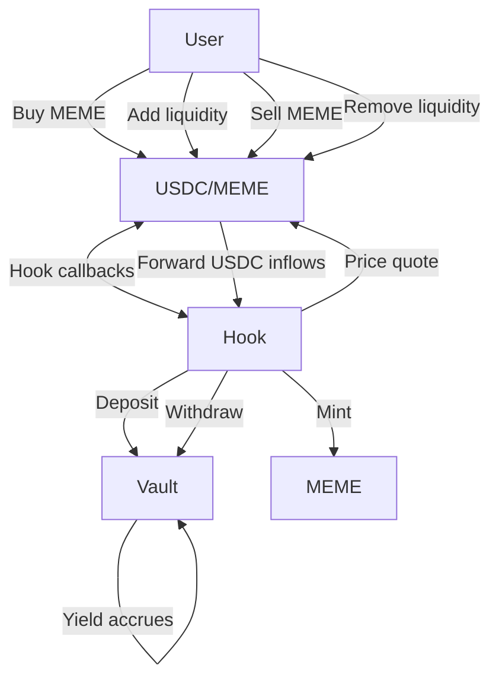
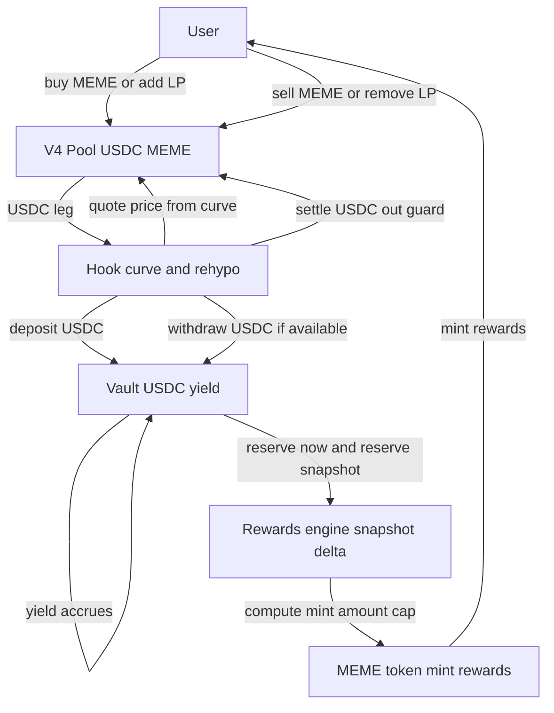
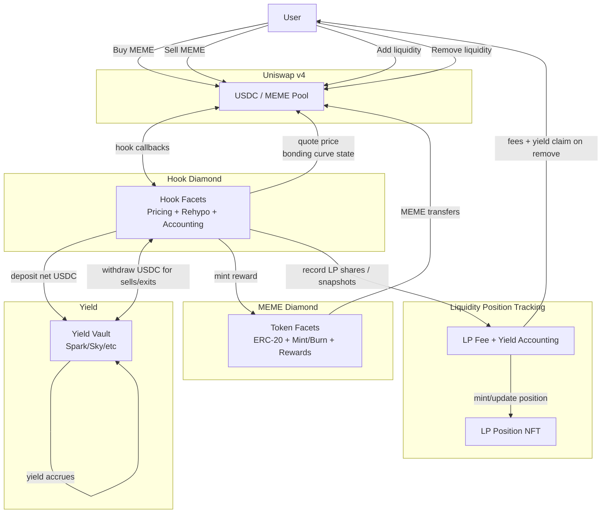

# Yieldmas – Rehypothecation-backed LP Yield Memecoin

## Dictionary

- **MEME** - a memecoin token used witin platform
- **MEME/USDC LP** - a liquidity pool for MEME/USDC with `Hook` integration
- **HOOK** - a Uniswap v4 hook with rehypotication features and bonding curve
- **yield** - vault yield from rehypoticating liquidity
- **LP-fees** - liquidity pool trading fees

---

## Concept

The project builts appon following paradigm:

"Idle liquidity is an contradiction of DeFi"

We aim to create a token that will rehypocate it's liquidity and allow our community to gain instat exposure to the value behind it. The liquidity pool will rehypocate stablecoins into a yieal bearing protocol and share profits among participants.

---

## High-level overview

1. Users buy the MEME with USDC
2. The LP calls Hook
3. Hook moves USDC into a vault (e.g., **Spark / Sky**)
4. Hooks mints MEME to User

### System Diagram

## User Flows

1. Buy token using USDC
2. Hook processes USDC and deposits into yield bearing vault
3. Add liquidity (token + USDC)
4. USDC is deposited again into yield bearing vault
5. LP is locked for some time using Hook logic (longer time → bigger reward?)
6. When you sell USDC it is withdrawn from Vault to vault each time
7. Vault fees are tracked & automatically collected when you want to remove liquidity
8. Locked token has inflation APY (example: 1 year deposit → same % as USDT APY)
9. Custom AMM → computes amounts based on balances in PoolManager & Vault

---

## Core Economic Loop

---

## Example math (simple bonding curve + LP fees)

### Assumptions

- LP fee rate: `f = 0.3% = 0.003` #TODO figure out if this not overcomplicates
- Vault APY: `r = 5% = 0.05`
- User actions:
  1. Buy MEME with `100 USDC`
  2. Add liquidity 1:1 by value and deposits an additional USDC
- Fee is taken first, **net USDC** is rehypothecated into the vault and earns yield.
- We compute profit in **USDC value**

## 1) How much USDC is working in the vault?

**Leg A (buy):**

- User pays: `100`
- LP fee: `100 * 0.003 = 0.30`
- Deposited to vault: `100 - 0.30 = 99.70 USDC`

**Leg B (LP add, USDC side):**

- User deposits: `100`
- LP fee: `100 * 0.003 = 0.30`
- Deposited to vault: `100 - 0.30 = 99.70 USDC`

**Total vault principal:**

- `D = 99.70 + 99.70 = 199.40 USDC`

---

## 2) Vault yield after ~1 year at 5% APY

- `yield_USDC = D * r`
- `yield_USDC = 199.40 * 0.05 = 9.97 USDC`

✅ **Vault yield earned by the user: ~9.97 USDC / year**

---

## 3) LP fee income (separate from vault yield)

Those `0.30 + 0.30 = 0.60 USDC` are **not “lost”**—they are LP revenue distributed by liquidity share and swap volume.

Concise formula:

- `lp_fees_USDC = 0.003 * V_year * share`

where:

- `V_year` = total swap volume through the pool over the year (USDC notional)
- `share` = user’s average share of liquidity (0..1)

Example:

- `V_year = 10,000 USDC`, `share = 0.2`
- `lp_fees_USDC = 0.003 * 10,000 * 0.2 = 6.0 USDC`

---

## Result after 1 year (USDC value)

- Vault yield: **~9.97 USDC**
- LP fees: `0.003 * V_year * share`

**Total profit (USDC value):**

- `profit ≈ 9.97 + 0.003 * V_year * share`

---

## Implementation Sketch

---
